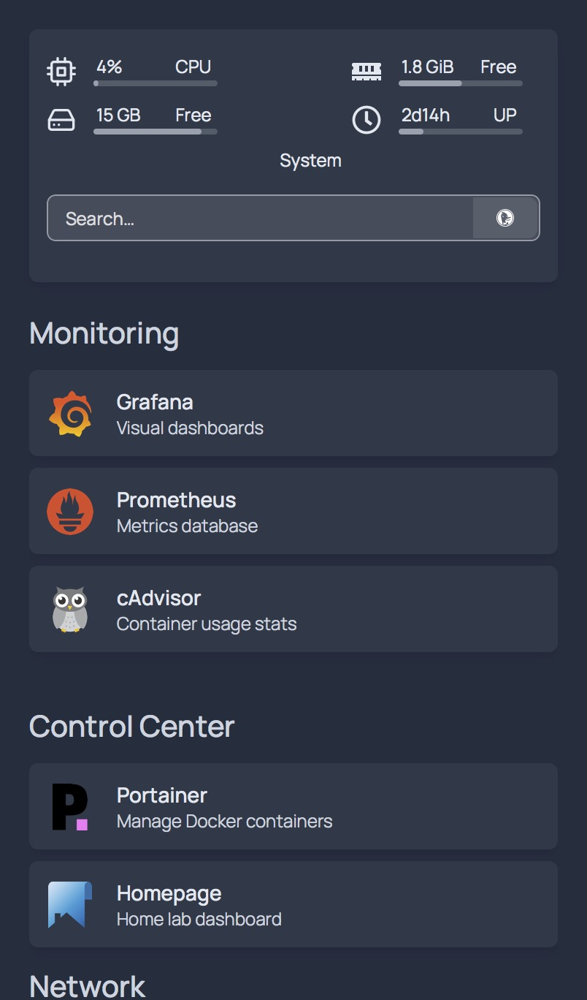

# Homepage Dashboard

## Objective
Create a centralized dashboard for managing and monitoring home lab services.

## Technologies
- Homepage
- Docker

## Services Displayed
- Grafana
- Prometheus
- Portainer
- Pi-hole
- Nextcloud
- FileBrowser
- n8n

## Skills Demonstrated
- Dashboard Configuration
- Service Organization
- Infrastructure Visibility
- Self-Hosted Services
- Docker Administration

## Outcome
Created a single-pane-of-glass dashboard for monitoring and managing infrastructure services.
